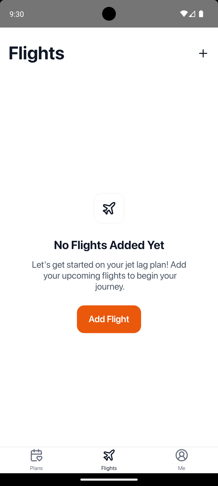
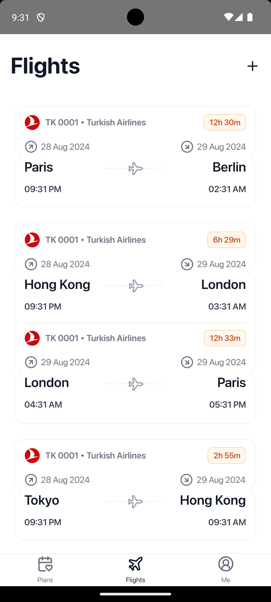
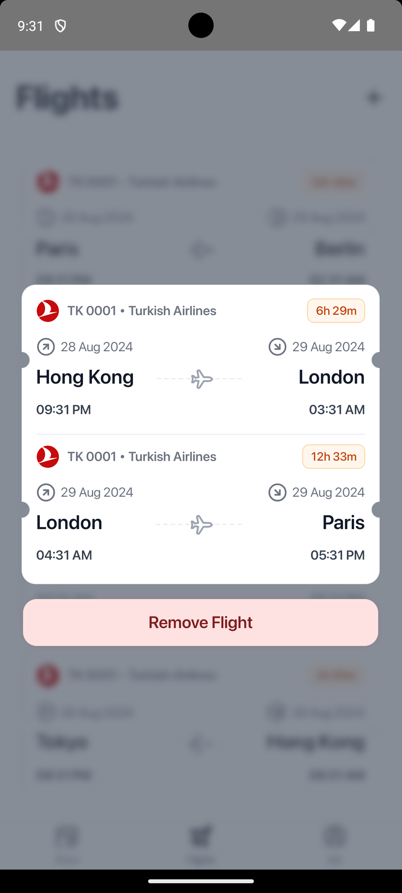
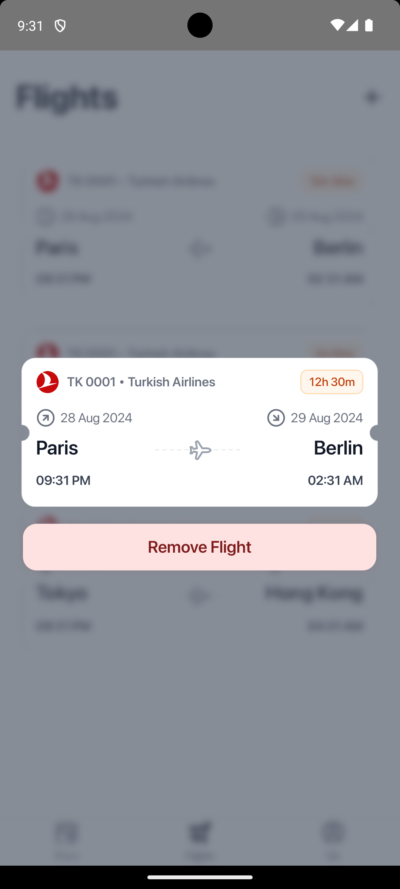

# React Native Project


## Screenshots

<p align="center">
  
  
  
  
</p>

## Getting Started

Follow these steps to get the project up and running on your device:

### 1. Install Dependencies
```bash
npm install
# or
yarn install
```

### 2. Start Metro Bundler
```bash
npm start
# or
yarn start
```

### 3. Run the App

#### Android:
```bash
npm run android
# or
yarn android
```

#### iOS:
```bash
npm run ios
# or
yarn ios
```

Once everything is set up correctly, the app should be up and running on your emulator or device.
